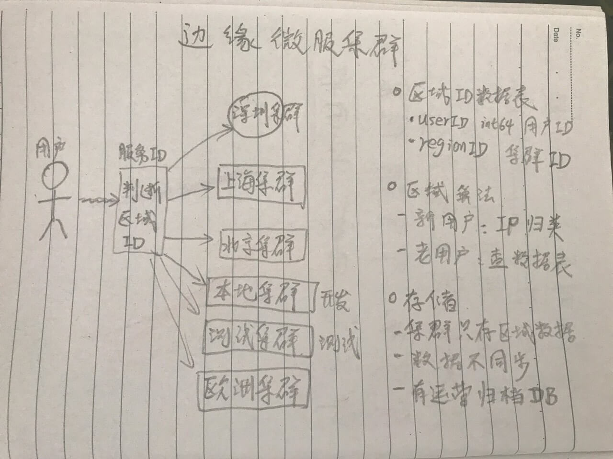
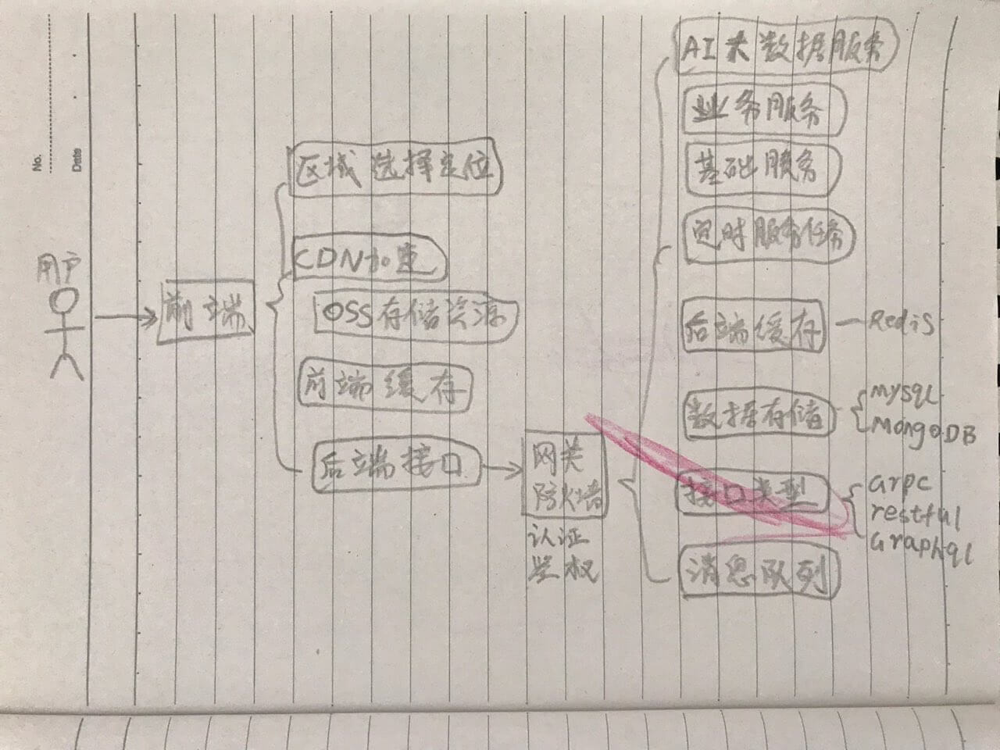
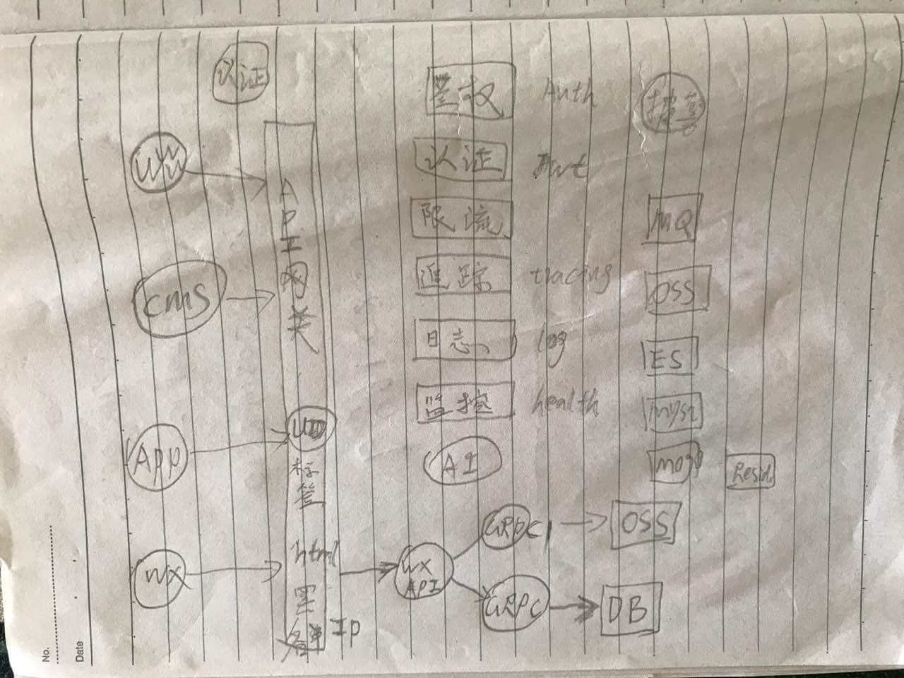

# 项目架构

区域图

前后端关联架构图

后端架构图

## 理论资源

[介绍架构分类、设计及架构师工作](https://tianmingxing.com/2019/06/07/%E4%BB%8B%E7%BB%8D%E6%9E%B6%E6%9E%84%E5%88%86%E7%B1%BB%E3%80%81%E8%AE%BE%E8%AE%A1%E5%8F%8A%E6%9E%B6%E6%9E%84%E5%B8%88%E7%9A%84%E5%B7%A5%E4%BD%9C/)
[人月神话](https://zh.wikipedia.org/wiki/%E4%BA%BA%E6%9C%88%E7%A5%9E%E8%AF%9D)